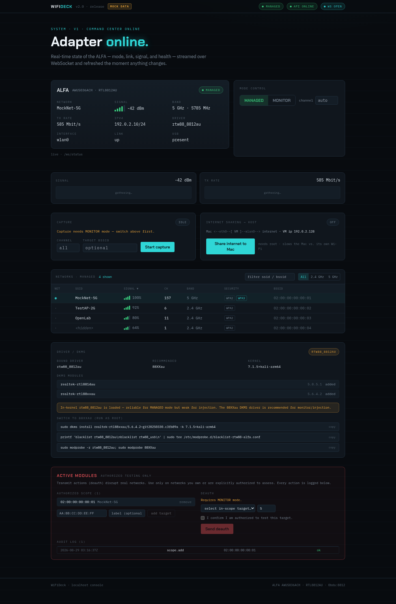

# WiFiDeck

A local, web-based **command center** for the ALFA AWUS036ACH (RTL8812AU) and
similar adapters. See live adapter state, flip **MANAGED ⇄ MONITOR**, scan, capture
handshakes, share internet to the host, watch signal/throughput charts, and run
authorization-gated active tests — all from a fast, dark, live dashboard in your
browser. Binds to `127.0.0.1` only, token-authed.

**Status: v2.5** — phases 0–13 complete. Full plan: [docs/PLAN.md](docs/PLAN.md).



## Features

| | |
|---|---|
| **Status** | live USB/driver/mode/link/signal + health (disconnect & `-71` detection) |
| **Mode** | MANAGED ⇄ MONITOR toggle with a serialized state machine |
| **Scan** | live network table (nmcli in managed, airodump in monitor), sort/filter |
| **Connect** | click any SSID to join/leave; NetworkManager saves the password |
| **Capture** | airodump sessions, handshake/PMKID detection, pcap export |
| **Share** | NAT the ALFA uplink to the host, with copyable macOS route/DNS commands |
| **Charts** | signal & TX-rate sparklines; driver/DKMS panel with switch hints |
| **Active** | gated deauth — off by default, scope allowlist + per-action auth + audit log |
| **Watchdog** | auto-recover the `-71` USB drops (driver reload → USB reset → reconnect) |
| **Guided flow** | one gated workflow: monitor → capture → deauth → handshake → export |
| **Defense** | WIDS-lite — evil-twin + deauth-flood detection with an alerts timeline |
| **Cracking** | aircrack-ng a captured handshake vs a wordlist, scope-gated, live progress |

## Quick start

Easiest — one command starts the backend + frontend and opens your browser
(Ctrl+C stops both). If the systemd service is running it just opens it:

```bash
./wifideck                 # http://localhost:5173  (view/scan/connect work as your user)
WIFIDECK_SUDO=1 ./wifideck # backend as root — needed for mode-switch / capture / deauth / sharing
WIFIDECK_MOCK=1 ./wifideck # no adapter needed (fixtures; UI shows a MOCK DATA badge)

# enable the gated offensive modules (deauth + guided capture) — your OWN networks only;
# each action still requires an in-scope target + the "I'm authorized" confirmation:
WIFIDECK_SUDO=1 WIFIDECK_ENABLE_ACTIVE=1 ./wifideck
```

Or run the pieces yourself:

```bash
# backend (real hardware needs root for mode/capture/share)
cd backend && python3 -m venv .venv && . .venv/bin/activate && pip install -r requirements.txt
WIFIDECK_TOKEN=dev-token-change-me PYTHONPATH=. uvicorn app.main:app --host 127.0.0.1 --port 8787

# frontend (needs Node 18+; nvm recommended)
cd frontend && npm install && npm run dev      # http://127.0.0.1:5173  (proxies /api + /ws)
```

## Install as a service (production)

```bash
cd frontend && npm run build          # build the SPA first (needs Node)
cd .. && sudo ./install.sh            # venv + deps + systemd service on 127.0.0.1:8787
```

The installer generates a random token in `/opt/wifideck/backend/.env` and prints
it — open `http://127.0.0.1:8787` and paste it once (stored in your browser).
Manage with `systemctl {status,stop,restart} wifideck` and `journalctl -u wifideck -f`.

## Security

Localhost-only, token on every route + WebSocket, constant-time compare. **Active
(transmit) modules are off by default** (`WIFIDECK_ENABLE_ACTIVE=1` to arm) and
gated by an in-scope BSSID allowlist + per-action authorization, with every attempt
audited. Use active features only on networks you own or are authorized to test.
Full model + the release checklist: [docs/SECURITY.md](docs/SECURITY.md). Re-run it
with `python3 scripts/security_check.py`.

## Tests

```bash
cd backend && PYTHONPATH=. pytest -q        # 54 tests
cd frontend && npm run test && npm run lint # 25 tests
python3 scripts/security_check.py           # 6 security invariants
```

## Docs

- [docs/PLAN.md](docs/PLAN.md) — the full phased plan · [docs/FUTURE.md](docs/FUTURE.md) — candidate future phases
- [docs/ARCHITECTURE.md](docs/ARCHITECTURE.md) · [docs/API.md](docs/API.md) · [docs/SECURITY.md](docs/SECURITY.md)
- [docs/phases/](docs/phases/) — per-phase build notes + acceptance results
- [`./wifideck`](wifideck) — launcher · [scripts/security_check.py](scripts/security_check.py) — security re-review

## License

MIT — see [LICENSE](LICENSE).
