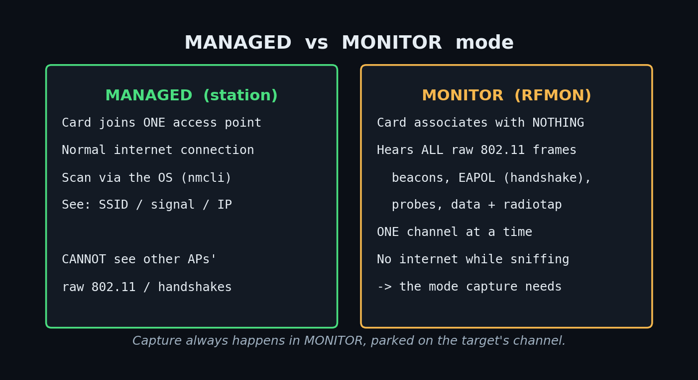
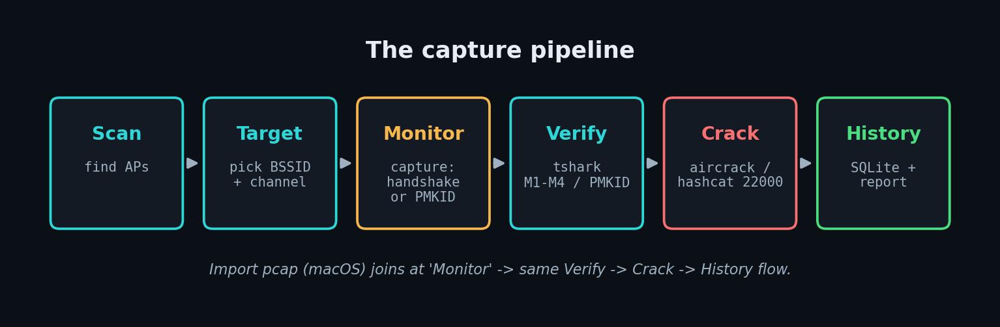

# WiFiDeck — User Guide

A complete tour of WiFiDeck: what every function does, **how to test it**, **what
to expect**, and — because you said you're learning — a curated set of **books,
videos, and websites** at the end so you can go deeper on the Wi-Fi security
concepts underneath.

> ⚖️ **Legal first.** Everything offensive here (monitor capture, deauth,
> handshake/PMKID cracking) is legal **only on networks you own or have written
> permission to test**. Capturing or attacking other people's networks is a crime
> in most countries (in Canada, see the Criminal Code s. 342.1 “unauthorized use
> of a computer” and s. 430(1.1) “mischief in relation to computer data”). Use
> your own lab AP. See [SECURITY.md](SECURITY.md) and [OFFENSIVE.md](OFFENSIVE.md).

**Related docs:** [README](../README.md) · [ARCHITECTURE](ARCHITECTURE.md) ·
[API](API.md) · [RADIO-ENVIRONMENT](RADIO-ENVIRONMENT.md) ·
[HARDWARE](HARDWARE.md) · [OFFENSIVE](OFFENSIVE.md) · [SECURITY](SECURITY.md) ·
[macOS setup](MACOS-SETUP.md).

---

## 1. What WiFiDeck is

A local, browser-based **command center** for a USB Wi-Fi adapter (the ALFA
AWUS036ACH / RTL8812AU, and similar). It shows live adapter state, scans for
networks, captures WPA handshakes / PMKIDs, verifies and cracks them against a
wordlist, and runs authorization-gated active tests — all from one dark,
real-time dashboard that talks to a small FastAPI backend over WebSockets.

It runs on **two platforms from one codebase** — it detects the OS and adapts:

| | **macOS** (native, primary) | **Linux** (VM or bare metal) |
|---|---|---|
| RF backend | libusb userspace driver (`rtl8812au-macos`) | kernel driver + `nl80211`/`iw`/`airodump` |
| Managed mode (join networks) | ❌ not possible¹ | ✅ yes |
| Monitor RX (sniff frames) | ✅ yes (2.4 + 5 GHz) | ✅ yes (with a working driver²) |
| Raw injection (deauth) | ✅ primitive proven | ✅ yes |
| “Scan” | brief monitor capture → beacons | managed `nmcli` **or** monitor `airodump` |
| Root needed? | no (runs as your user) | yes (mode/capture/deauth/share) |

¹ macOS forbids third-party Wi-Fi kexts on Apple Silicon; a userspace libusb
driver can't be a system Wi-Fi interface, so it can't do managed mode. See
[RADIO-ENVIRONMENT.md](RADIO-ENVIRONMENT.md).
² On Linux, monitor RX needs a driver that actually delivers frames for the
chip; the in-tree `rtw88` advertises monitor for the RTL8812AU but delivers no
RX — use the aircrack `rtl8812au` DKMS driver on a kernel ≤ 6.15. See
[HARDWARE.md](HARDWARE.md).

The top-rail chip and **Radio Doctor** panel tell you at a glance which OS,
backend, adapter, driver, and capabilities are active.

---

## 2. The core concept: MANAGED vs MONITOR mode

This is the single most important idea in the whole tool, so it gets its own
section.



### Managed mode (a.k.a. “station” / “client”)
The normal way a Wi-Fi card works. The card **associates** with one access point,
follows its channel, and the OS handles encryption, so you get a normal internet
connection. In managed mode you can:
- **join/leave** networks (Connect),
- **scan** by asking the OS for its network list (`nmcli` on Linux),
- see your link's SSID / signal / IP / TX-rate.

What you **can't** do in managed mode: see other people's raw 802.11 frames. The
card only hands the OS the traffic for the network it's joined to, already
decrypted — the handshakes and management frames you need for a capture are
filtered out.

### Monitor mode (a.k.a. “RFMON” / “promiscuous 802.11”)
The card **stops associating** and instead reports **every raw 802.11 frame it
hears** on the channel it's parked on — beacons, probe requests, association and
**authentication/EAPOL (handshake) frames**, data frames, from **all** nearby
APs and clients — each wrapped in a **radiotap** header (channel, signal, rates).
This is the mode that makes sniffing and capture possible. The trade-offs:
- **No internet** while in monitor mode (the card isn't associated).
- **You only hear one channel at a time.** A capture on channel 6 will not see an
  AP on channel 44. You must set the card to the **target's channel**.
- **On this adapter, monitor can't enumerate SSIDs by name the way managed does**
  — beacons still carry the SSID, but there's no “network list” API. That's why
  WiFiDeck does the two things below.

### How WiFiDeck bridges the gap (important, and subtle)
Because monitor mode can't give you a clean managed-style network list, WiFiDeck
does platform-specific things so the **Target picker** is still populated:

- **Linux:** the instant you switch **MANAGED → MONITOR**, the backend first runs
  one fresh **managed scan and snapshots it** ([mode.py](../backend/app/services/mode.py)
  `_to_monitor`). That remembered list (each entry keeps its **channel**) is what
  fills the deauth/capture pickers while you're in monitor. A scan failure never
  blocks the switch. The frontend re-fetches this “known networks” list whenever
  the mode changes ([useKnownNetworks.ts](../frontend/src/hooks/useKnownNetworks.ts)).
- **macOS:** there is no managed mode to snapshot, so the **Scan (monitor)** panel
  does a brief (~5 s) capture on a channel, parses the **beacons** it heard, and
  fills the Target picker from those ([ScanPanel.tsx](../frontend/src/components/ScanPanel.tsx),
  `POST /api/scan/once`).

**Practical model to remember:** *managed = “what network am I on?”; monitor =
“what frames can I hear on this one channel?”.* Capture always happens in monitor,
on the target's channel.

**How to test the mode switch (Linux, real hardware):**
1. `WIFIDECK_SUDO=1 ./wifideck`, open the dashboard.
2. Adapter status shows `MANAGED`. Scan → you see the network list.
3. Click **MONITOR** in Mode Control. Expect: a brief transition, then status
   shows `MONITOR`, the top-rail mode pill turns amber, and the Target picker is
   populated from the snapshot taken a second earlier.
4. Click **MANAGED** to switch back; the network list refreshes live again.
- A second switch requested mid-transition returns **HTTP 409 (busy)** by design —
  the state machine serializes switches so the radio can't be corrupted.

**On macOS:** there is no MANAGED/MONITOR toggle (the UI hides it because the
radio reports `managed:false`); the card is effectively always a monitor/capture
device. Use the **Scan (monitor)** panel instead.

---

## 3. Every function, how to test it, what to expect

Each function below maps to a panel in the UI and a small backend service/router.
Fastest way to explore **all** of them with **no hardware** is mock mode:

```bash
WIFIDECK_MOCK=1 ./wifideck      # UI shows a MOCK DATA badge; every panel has fixtures
```



### 3.1 Adapter Status  ·  `GET /api/status`, `WS /ws/status`
**What:** live USB presence, driver, interface, mode, link state, SSID, IP,
signal (dBm), TX-rate, and a health verdict (OK / DISCONNECTED / DEGRADED, incl.
the `-71 dBm` weak-signal flag).
**Test:** just open the app. **Expect:** the card updates the instant anything
changes (it's streamed, not polled). Unplug the adapter (Linux) → within a beat
the banner flips to **ADAPTER DISCONNECTED**.

### 3.2 Mode Control  ·  `POST /api/mode`
**What:** the MANAGED ⇄ MONITOR switch (Linux). **Test/Expect:** see §2 above.
Hidden on monitor-only radios (macOS).

### 3.3 Scan / Network Table  ·  `WS /ws/scan`, `POST /api/scan/once`
**What:** the list of networks. In managed it's `nmcli`; in monitor (Linux) it's
`airodump-ng`; on macOS it's the monitor beacon-scan. Columns: SSID, signal, CH,
band, security, BSSID. Sort and filter; filter by band (All / 2.4 / 5 GHz).
**Test:** scan near any AP. **Expect:** for an enterprise SSID you'll see the
**same name on several rows** — that's normal (multiple APs + multi-BSSID virtual
APs); each row is a distinct **BSSID+channel** you can target. See the security
column classify each as **WPA2 / WPA3 / WPA3-transition / OWE / OPEN / 802.1X**.

### 3.4 Posture (security classification)  ·  [posture.py](../backend/app/services/posture.py)
**What:** flags what each network's security means for capture — e.g. WPA2-PSK is
crackable offline if you catch a handshake; **WPA3-SAE is not** offline-crackable;
**WPA3-transition** can often be downgraded to WPA2; OWE/OPEN have no PSK to crack.
**Test:** look at the SECURITY chips in the table. **Expect:** color-coded tone +
a one-line “what this means” note on the selected target.

### 3.5 Target selector  ·  [TargetSelector.tsx](../frontend/src/components/TargetSelector.tsx)
**What:** **pick the network once**; the choice (a BSSID + channel) is shared by
deauth and guided capture, so you don't re-select per function.
**Test:** pick a row. **Expect:** confirmation chips (SSID · ch · band · security ·
BSSID). If empty in monitor: “switch to MANAGED once to scan, then come back.”

### 3.6 Connect  ·  `POST /api/connect`
**What (Linux, managed):** click an SSID to join/leave; NetworkManager stores the
password. **Test:** Connect to your own AP. **Expect:** status shows the SSID + an
IP; a **Disconnect** button on the active row (see your screenshot — the filled
radio dot marks the joined BSSID).

### 3.7 Capture  ·  `POST /api/capture`, `WS /ws/capture`
**What:** the heart of it. Two modes:
- **Handshake** — runs `airodump-ng` locked to the target channel and waits for a
  client's **4-way handshake (EAPOL M1–M4)**. Pair with a **deauth** (§3.11) to
  make a client reconnect and hand you the handshake faster.
- **PMKID (clientless)** — runs `hcxdumptool` to solicit a **PMKID** straight from
  the AP; **no client needed**, works when the AP supports it.

**Test (live, your AP):** switch to MONITOR (Linux) → set the target's channel →
start a **handshake** capture → briefly deauth a phone on that AP → watch frames
climb. Or start a **PMKID** capture and just wait.
**Expect:** a live session with a frame counter and, on success, a
**HANDSHAKE ✓** or **PMKID ✓** badge and an exportable `.pcap`. No hardware? Mock
mode fabricates a session so you can see the whole flow.

### 3.8 Import pcap  ·  `POST /api/capture/import`  ·  [ImportPcap.tsx](../frontend/src/components/ImportPcap.tsx)
**What:** adopt a pcap captured elsewhere (e.g. the macOS `capture.py -o out.pcap`)
as a capture session — it's copied in, scanned for handshake/PMKID, and recorded
to history, so it flows through **verify → crack → report** like any capture. This
is the **macOS capture bridge**.
**Test:** capture a pcap on macOS, paste its path (+ optional BSSID), Import.
**Expect:** “imported — handshake: yes/no”, and a new History row.

### 3.9 Verify  ·  [handshake.py](../backend/app/services/handshake.py)
**What:** `tshark` confirms a capture actually contains a **complete 4-way
handshake** (M1–M4) or a PMKID **before** you waste time cracking.
**Test:** import/capture, then verify. **Expect:** an explicit M1–M4 / PMKID
readout; a partial handshake is flagged as not yet crackable.

### 3.10 Cracking  ·  `POST /api/crack`, `WS /ws/crack`
**What:** run **aircrack-ng** or **hashcat (mode 22000, the modern WPA format)**
against a wordlist. Scope-gated and live-progress.
**Test:** point it at a wordlist (e.g. a tiny custom list containing your lab
AP's known password) and your captured handshake. **Expect:** live progress and,
on success, the recovered key; the outcome is written to **History**.
**Reality check:** cracking only recovers **weak/guessable** passphrases from a
wordlist — it is **not** a magic WPA2 break, and it **does not work on WPA3-SAE**.
See §5 and [OFFENSIVE.md](OFFENSIVE.md).

### 3.11 Active modules — Deauth  ·  `POST /api/active/deauth`  ·  [OFFENSIVE.md](OFFENSIVE.md)
**What:** send 802.11 **deauthentication** frames to knock a client off, so it
reconnects and you catch its handshake. **Off by default.**
**Arm it:** `WIFIDECK_SUDO=1 WIFIDECK_ENABLE_ACTIVE=1 ./wifideck`.
**Test:** pick your target, confirm once. **Expect:** every action is **audited**
(who/when/what BSSID) and requires an explicit confirm. **Note:** deauth is a WPA2
technique; **802.11w / PMF** (mandatory in WPA3) makes management frames
protected, so deauth is rejected — which is exactly why WPA3 matters.

### 3.12 Guided flow  ·  `POST /api/flow/*`  ·  [FlowPanel.tsx](../frontend/src/components/FlowPanel.tsx)
**What:** one gated workflow that chains it end-to-end: **monitor → capture →
(deauth) → handshake → export**, with a step tracker.
**Test:** pick a target, start the flow. **Expect:** each step lights up as it
completes; the flow stops on the first failure and tells you why.

### 3.13 Stations  ·  `GET /api/stations`  ·  [StationsPanel.tsx](../frontend/src/components/StationsPanel.tsx)
**What:** clients (stations) seen associated to APs during a monitor scan —
useful to know which AP actually has clients worth deauthing.
**Test:** monitor-scan near an active AP. **Expect:** a client list with the BSSID
each is talking to.

### 3.14 Watchdog  ·  `WS /ws/watchdog`  ·  [WatchdogPanel.tsx](../frontend/src/components/WatchdogPanel.tsx)
**What:** auto-recovers the ALFA's `-71`/USB-drop wedges (driver reload → USB
reset → reconnect). **Test:** enable it, then induce a drop. **Expect:** an events
timeline showing the recovery steps.

### 3.15 WIDS-lite (defense)  ·  `WS /ws/wids`  ·  [WidsPanel.tsx](../frontend/src/components/WidsPanel.tsx)
**What:** the **defensive** side — detects **evil-twin** APs (same SSID, new
BSSID) and **deauth floods**, with an alerts timeline. Set a baseline of “known
good” first. **Test:** baseline, then run a deauth from another device. **Expect:**
a deauth-flood alert. Great for learning what an attack *looks like* from the
defender's chair.

### 3.16 Anomaly, Metrics, Share, History, Report, Schedule, Integrations
- **Anomaly** — flags odd signal/behaviour patterns.
- **Metrics** — signal & TX-rate **sparklines** over time.
- **Share** (`/api/share`, Linux) — NAT the adapter's uplink to your host, with
  copyable macOS route/DNS commands.
- **History** (`/api/history`, SQLite) — past capture sessions + crack outcomes,
  persisted across restarts. **Test:** import a pcap, restart the backend, reopen —
  the row is still there.
- **Report** (`/api/report`) — an HTML summary of your sessions/findings.
- **Schedule** (`/api/schedule`) — run captures/scans on a timer.
- **Integrations** (`/api/notify`) — webhook / ntfy / Slack notifications; the
  panel has a **Send test** button. **Expect:** a test message at your endpoint.

---

## 4. Testing playbooks

### 4.1 Zero-hardware tour (any OS, 2 minutes)
```bash
WIFIDECK_MOCK=1 ./wifideck
```
Click through every panel. A **MOCK DATA** badge is shown; nothing touches real
radios. Best way to learn the UI and the capture→verify→crack→history flow.

### 4.2 Live recon on macOS (your own AP)
1. Set up the libusb driver once ([MACOS-SETUP.md](MACOS-SETUP.md)).
2. `./wifideck` → top rail shows **🍎 macOS**, Radio Doctor shows the libusb backend.
3. **Scan (monitor)** on your AP's channel → APs fill the Target picker.
4. Capture a pcap with the driver's `capture.py -o out.pcap` on your channel →
   **Import pcap** → **Verify** → **Crack** (against a wordlist you control).

### 4.3 Live recon on Linux (your own AP)
1. Working DKMS driver on a kernel ≤ 6.15 ([HARDWARE.md](HARDWARE.md)).
2. `WIFIDECK_SUDO=1 WIFIDECK_ENABLE_ACTIVE=1 ./wifideck`.
3. Scan (managed) → pick your AP as the Target → switch **MONITOR** (channel is
   remembered) → **Capture (handshake)** → **Deauth** your own phone once →
   handshake ✓ → **Verify** → **Crack**.

### 4.4 What “success” and “failure” look like
- **Good capture:** frame counter climbs; **HANDSHAKE ✓** / **PMKID ✓**; pcap
  exportable; History row created.
- **No handshake:** counter climbs but no ✓ — usually **wrong channel**, no client
  on that AP, or PMF blocking deauth. Fix the channel first.
- **Crack “not found”:** the passphrase isn't in your wordlist (expected for
  strong passwords), or the network is **WPA3-SAE** (not offline-crackable).

---

## 5. The honest truth about WPA2 vs WPA3 (so you learn the *why*)

- **WPA2-PSK:** capture a **4-way handshake** (or a **PMKID**) → run a **dictionary/
  brute-force** attack **offline**. You are only limited by how guessable the
  password is and your GPU. This is what WiFiDeck's capture→crack pipeline does.
- **WPA3-SAE (“Dragonfly”):** replaces the crackable handshake with a
  **zero-knowledge** exchange — there is **no captured value you can take offline**
  and brute-force. There is no known practical offline crack of a correctly
  configured WPA3-SAE network. The real-world attacks are:
  - **Transition-mode downgrade:** many “WPA3” networks also accept WPA2 for old
    clients; you attack the WPA2 side. Pure WPA3-only closes this.
  - **Dragonblood (2019):** side-channel/downgrade bugs in early WPA3
    implementations — largely patched.
  - **PMF/802.11w:** WPA3 mandates protected management frames, so **deauth
    doesn't work**, which breaks the classic handshake-forcing trick.

Takeaway: WPA3 didn't “get cracked” — it removed the offline-crackable artifact.
The lesson is defensive as much as offensive.

---

## 6. Learning resources

Curated, and grouped by how you like to learn. Prefer official/primary sources.

### 📚 Books
- **“Kali Linux Wireless Penetration Testing”** — Cameron Buchanan / Vivek
  Ramachandran (Packt). Hands-on airmon/airodump/aircrack workflow — closest to
  what WiFiDeck automates.
- **“The Hacker Playbook 3”** — Peter Kim. Practical methodology incl. a Wi-Fi
  chapter; good for how recon fits a full engagement.
- **“802.11 Wireless Networks: The Definitive Guide”** — Matthew Gast (O'Reilly).
  The protocol bible: frames, management vs data, the 4-way handshake — read this
  to truly understand *monitor mode*.
- **“Hacking Exposed Wireless”** — Cache/Wright/Liu. Attacks + defenses across
  Wi-Fi/Bluetooth.
- **“CWNA / CWSP Study Guides”** (Sybex) — the vendor-neutral certification
  track; CWNA for RF/802.11 fundamentals, **CWSP** for the security deep-dive.

### 🎥 Videos / channels
- **Vivek Ramachandran — “WLAN Security Megaprimer”** (SecurityTube) — the classic
  free monitor-mode/aircrack video course.
- **David Bombal** (YouTube) — Wi-Fi hacking with ALFA adapters, hashcat, and
  interviews with tool authors; very beginner-friendly.
- **NetworkChuck** (YouTube) — approachable Wi-Fi/Kali intros.
- **Hak5** (YouTube) — Wi-Fi Pineapple/deauth demos; good for seeing attacks live.
- **DEF CON / conference talks** (YouTube “DEFCONConference”) — search “WPA3”,
  “Dragonblood”, “802.11”.

### 🌐 Websites / docs / tools
- **Aircrack-ng wiki** — https://www.aircrack-ng.org/doku.php — the canonical docs
  for airmon-ng/airodump-ng/aircrack-ng (exactly the tools under the hood).
- **hashcat wiki + mode 22000** — https://hashcat.net/wiki/ and
  https://hashcat.net/forum/thread-7717.html (the WPA-PBKDF2/PMKID 22000 format).
- **hcxdumptool / hcxtools** — https://github.com/ZerBea/hcxdumptool — clientless
  PMKID capture (WiFiDeck's PMKID mode).
- **Wireshark** — https://www.wireshark.org/ — open a WiFiDeck `.pcap`, filter
  `eapol` to see the M1–M4 handshake yourself; `wlan.fc.type_subtype==0x08` for
  beacons. WiFiDeck uses its CLI `tshark` for verification.
- **Wi-Fi Alliance — WPA3 spec/overview** — https://www.wi-fi.org/discover-wi-fi/security
- **Dragonblood** — https://wpa3.mathyvanhoef.com/ — Mathy Vanhoef's WPA3 attack
  research (and read up on **KRACK**, his WPA2 handshake attack).
- **Kali Linux docs** — https://www.kali.org/docs/ — drivers, wireless setup.
- **RTL8812AU drivers** — aircrack's DKMS fork
  https://github.com/aircrack-ng/rtl8812au (Linux) and the macOS libusb driver
  referenced in [MACOS-SETUP.md](MACOS-SETUP.md).

### 🧪 Safe places to practice (don't touch networks you don't own)
- **Your own lab AP** — a cheap travel router or a spare home router flashed with
  a known weak passphrase you set, is the ideal target.
- **Hack The Box / TryHackMe** — guided labs (mostly host/web, some wireless
  theory).
- **CTFs** — search “wireless CTF”, “802.11 pcap challenge”; great for practicing
  handshake analysis in Wireshark without transmitting anything.

### 🔑 Concepts worth searching as you go
`802.11 frame types` · `4-way handshake / EAPOL` · `PMKID` · `radiotap header` ·
`beacon vs probe` · `BSSID vs SSID vs ESSID` · `multi-BSSID / virtual AP` ·
`monitor mode / RFMON` · `channel vs frequency / 2.4 vs 5 GHz` · `PMF / 802.11w` ·
`WPA2-PSK vs WPA3-SAE` · `hashcat mode 22000` · `deauthentication attack` ·
`evil twin` · `KRACK` · `Dragonblood`.

---

## 7. Troubleshooting quick hits
- **“No networks in the Target picker (monitor).”** Switch to MANAGED once to
  snapshot a scan (Linux), or use **Scan (monitor)** (macOS). Confirm you're on
  the target's **channel**.
- **“Handshake never completes.”** Wrong channel, no client on that AP, or PMF is
  blocking deauth (WPA3). Try PMKID instead.
- **“iw: No such file / managed failed” on macOS.** Expected — macOS has no
  managed mode; the toggle is hidden and Scan is monitor-based.
- **Adapter “off the bus” after a capture (macOS).** A known post-capture wedge —
  physically replug the ALFA.
- **Crack finds nothing.** Password not in the wordlist, or it's WPA3-SAE.

*See [BUILD-LOG.md](BUILD-LOG.md) for the running change history and
[RADIO-ENVIRONMENT.md](RADIO-ENVIRONMENT.md) for the deep hardware/driver story.*
